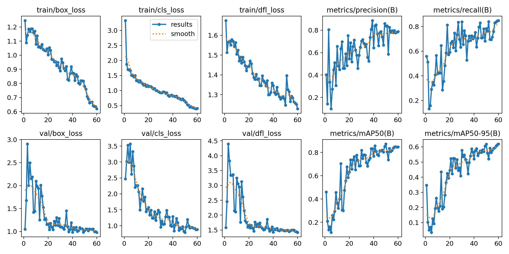

# 🗑️ WasteVision — Real-Time Waste Classification using YOLO11s

<p align="center"><b>Real-time waste detection system powered by YOLO11s and trained on Kaggle waste dataset.</b></p>

<p align="center">

  
  
  
  
  

</p>

---

# 📑 Table of Contents
- [🔍 Project Overview](#-project-overview)
- [✨ Features](#-features)
- [📂 Project Structure](#-project-structure)
- [🧾 Dataset](#-dataset)
- [🏋️ Training Details](#-training-details)
- [📸 Model Performance](#-model-performance)
- [🎥 Demo](#-demo)
- [🛠️ Installation](#️-installation)
- [▶️ How to Run](#️-how-to-run)
- [🗃️ Classes](#️-classes)
- [🌱 Applications](#-applications)
- [🚀 Future Improvements](#-future-improvements)
- [🤝 Contributing](#-contributing)
- [📜 License](#-license)

---

# 🔍 Project Overview

**WasteVision** is a real-time object detection system that identifies different types of waste materials using **YOLO11s**.  
This project helps automate waste management and supports smart recycling solutions.

The model is trained on a curated **Kaggle waste dataset**, optimized for speed and accuracy.

---

# ✨ Features

✔ Real-time detection (webcam / CCTV / video files)  
✔ Fast + lightweight YOLO11s architecture  
✔ Trained using Kaggle waste images  
✔ Detailed training metrics (F1 curve, confusion matrix, PR curve)  
✔ Deployable on edge devices (Raspberry Pi, Jetson Nano)  
✔ Clean project structure for easy reproduction  

---

# 📂 Project Structure

```
project/
│
├── data/
│   ├── images/
│   ├── labels/
│   ├── classes.txt
│   └── notes.json
│
├── my_model/
│   └── train/
│       ├── weights/
│       ├── args.yaml
│       ├── BoxF1_curve.png
│       ├── BoxP_curve.png
│       ├── BoxPR_curve.png
│       ├── BoxR_curve.png
│       ├── confusion_matrix.png
│       ├── results.png
│       ├── results.csv
│       ├── train_batch*.jpg
│       ├── val_batch*_labels.jpg
│       └── val_batch*_pred.jpg
│
├── detect.py
├── train.py
├── requirements.txt
└── README.md
```

---

# 🧾 Dataset

Dataset used: **Kaggle Waste Classification Dataset**

Categories included:

- Plastic  
- Metal  
- Glass
- Organic
- Paper  
- Cardboard  
- Trash / Mixed waste  

Images were annotated and converted into YOLO format (`images + labels.txt`).

---

# 🏋️ Training Details

### Base Model  
**YOLO11s** (light & fast).

### Training Code
```python
from ultralytics import YOLO

model = YOLO("yolo11s.pt")
model.train(
    data="data.yaml",
    epochs=100,
    imgsz=640,
    batch=16,
    name="waste_model"
)
```

### Training Output Includes  
📌 F1 Curve  
📌 Precision Curve  
📌 Recall Curve  
📌 Confusion Matrix  
📌 Sample predictions (train/val batches)  
📌 Best & last weights  

---

# 📸 Model Performance

Add real images from your training output:

```



```

---

# 🎥 Demo

To create a GIF demo, record your detection window using **ScreenToGif** (Windows) or **Peek** (Linux).

Example placeholder:

```

```

---

# 🛠️ Installation

```bash
git clone https://github.com/your-username/WasteVision.git
cd WasteVision
pip install -r requirements.txt
```

---

# ▶️ How to Run

### 1️⃣ Real-time Webcam Detection
```python
model.predict(source=0, show=True)
```

### 2️⃣ Image Detection
```python
model.predict(source="test.jpg", show=True)
```

### 3️⃣ Video Detection
```python
model.predict(source="video.mp4", show=True)
```

---

# 🗃️ Classes

```
0 plastic
1 metal
2 glass
3 paper
4 cardboard
5 trash
```

---

# 🌱 Applications

- Smart waste sorting bins  
- Waste management systems  
- Recycling plants  
- Environmental monitoring  
- Robotics + automation  
- College projects & research  

---

# 🚀 Future Improvements

- Deploy with Flask / FastAPI  
- On-device inference (TensorRT, TFLite)  
- Mobile version (Android / iOS)  
- Add semantic segmentation  
- Add tracking (ByteTrack / DeepSort)  

---

# 🤝 Contributing

Feel free to open issues or PRs. Contributions are welcome!

---

# 📜 License

This project is licensed under the **MIT License**.

